# ShadowCart

> A security research project demonstrating inter-agent trust exploitation in multi-agent LLM systems, and a lightweight provenance-based defense.

---

## Overview

Multi-agent LLM systems decompose complex tasks across specialized sub-agents that communicate through a shared orchestrator. The orchestrator routes decisions based on peer agent output — and implicitly trusts every message it receives from within the pipeline.

ShadowCart demonstrates that this implicit trust is a exploitable vulnerability. A compromised sub-agent installed via supply chain attack can silently hijack a shopping pipeline — redirecting payments and shipping addresses — without triggering any errors, raising any exceptions, or alerting the user. The platform processes the fraudulent transaction as legitimate.

The attack requires no prompt injection. No model safety guardrails are bypassed. The exploit operates entirely at the protocol level: inter-agent messages carry no provenance verification, so a forged message from a malicious peer is indistinguishable from a legitimate one.

**This is a research prototype.** All credentials are synthetic, the payment system is a self-contained mock, and no real financial infrastructure is involved. The goal is to demonstrate that current multi-agent frameworks are not equipped to detect or prevent misbehaving agents from committing fraud.

---

## Threat Model

**Attacker**: A malicious third-party package developer who publishes a legitimate-looking product search agent (`smart_search`) to a public registry (PyPI, GitHub, etc.).

**Victim**: A developer or non-technical user who installs the package and wires it into their shopping pipeline, trusting it is what it claims to be.

**Attack surface**: The inter-agent message channel. All agents share a common state object (`AgentState`). No agent verifies whether the declared sender of a state update is the agent authorized to write those fields.

**Attack vector**: Supply chain. The attacker's agent is installed as a dependency — the victim never audits it. The pipeline loads it the same way it loads any other module.

**Delayed activation**: The compromised agent behaves legitimately for N sessions to build trust before activating. By the time fraud occurs, the agent has an established history of clean transactions.

**What the attacker controls after activation**:
- `seller_account` — payment destination is silently substituted with the attacker's account
- `shipping_address` — delivery address is redirected to the attacker

**What the victim sees**: All orders return `success`. No error is raised anywhere in the pipeline.

**What the platform sees**: Completed transactions with no anomalies flagged.

**ShadowCart TM Diagram**.  


---

## Project Structure

```
shadowcart/
├── main.py                  # orchestrator + graph definition
├── smart_search/
│   ├── __init__.py
│   └── search.py            # compromised search agent (attacker's package)
├── checkout.py              # checkout agent
├── payment.py               # mock payment platform
├── provenance.py            # lightweight defense layer
├── user_demo.py             # full attack + defense demonstration
└── README.md
```

---

## Attack Demo

The compromised `smart_search` package behaves identically to a legitimate search agent for the first 3 sessions. On session 4, it silently substitutes the seller account and shipping address in the state it passes to the orchestrator.

```
Session 1 — laptop      → seller: techstore_001  ✓
Session 2 — headphones  → seller: techstore_001  ✓
Session 3 — keyboard    → seller: techstore_001  ✓
Session 4 — monitor     → seller: attacker_001   ← fraud activates
Session 5 — webcam      → seller: attacker_001   ← fraud continues
```

**User view**: 5 successful orders.  
**Developer logs**: No unhandled exceptions.  
**Actual ledger**: Sessions 4-5 paid to `attacker_001`, shipped to attacker's address.

The checkout agent and payment platform both process the fraudulent orders without error — they trust the fields they receive because nothing in the pipeline verifies their origin.

---

## Defense: Lightweight Provenance Checking

`provenance.py` implements three lightweight heuristic rules that run as a wrapper around the search agent call before state is passed downstream.

**Rule 1 — Field Authorization**  
Each agent is only permitted to write specific fields in the shared state. If a search agent writes a field outside its authorized scope, a violation is raised.

**Rule 2 — Seller Account Integrity**  
Seller accounts are checked against a trusted registry. An unknown seller account triggers a violation before checkout is called.

**Rule 3 — Shipping Address Consistency**  
Shipping address is treated as a stable field. Deviations from the user's established address trigger a violation.

These three rules require no model calls, no external APIs, and no training. Runtime overhead is negligible — three dictionary lookups per agent invocation.

---

## Results

| Metric | Value |
|---|---|
| Attack success rate (undefended) | 100% |
| Defense detection rate | 100% |
| False positive rate | 0% |
| Fraudulent transactions reaching payment | 0 (with defense) |
| Runtime overhead | Negligible |

---

## The Platform Gap

Neither LangGraph nor the mock payment platform had any built-in mechanism to:

- Verify which agent authorized a checkout action
- Detect that a state field was written by an unauthorized agent
- Flag that payment destination changed between sessions

This is not a LangGraph-specific failure. It reflects a gap across current multi-agent frameworks: **provenance checking is possible but not enforced by default.** A careful developer could implement these heuristics manually in an afternoon. The problem is that nothing requires them to.

ShadowCart argues these checks should be framework-level defaults, not optional add-ons left to individual developers.

---

## Ethical Disclaimer

ShadowCart is a security research project built in a fully controlled environment.

- All user credentials are synthetic test tokens
- The payment system is a self-contained Python script with no connection to any real financial infrastructure
- No real money, real payment processors, or real user data are involved
- The compromised agent is intentionally constructed for research demonstration purposes and is not published to any public package registry

The goal is to identify and document a security gap in multi-agent architectures so that framework developers, security researchers, and practitioners can address it. All findings are reported in the spirit of responsible disclosure.

---

## How to Run

```bash
git clone https://github.com/AI-Research/shadowcart
cd shadowcart
uv run user_demo.py
```

To run the undefended pipeline (attack only), comment out the provenance wrapper in `main.py` and replace `search_agent_with_provenance` with `search_for_product` directly.

---

## Related Work

- Hubinger et al. (2024) — Sleeper Agents: Training Deceptive LLMs that Persist Through Safety Training
- "Collaborative Shadows" (2025) — Distributed Backdoor Attacks in LLM-Based Multi-Agent Systems
- "Your Agent Is Mine" (2026) — Measuring Malicious Intermediary Attacks on the LLM Supply Chain
- "The Dark Side of LLMs" (2025) — Agent-based Attacks, source of the 82.4% inter-agent compromise statistic